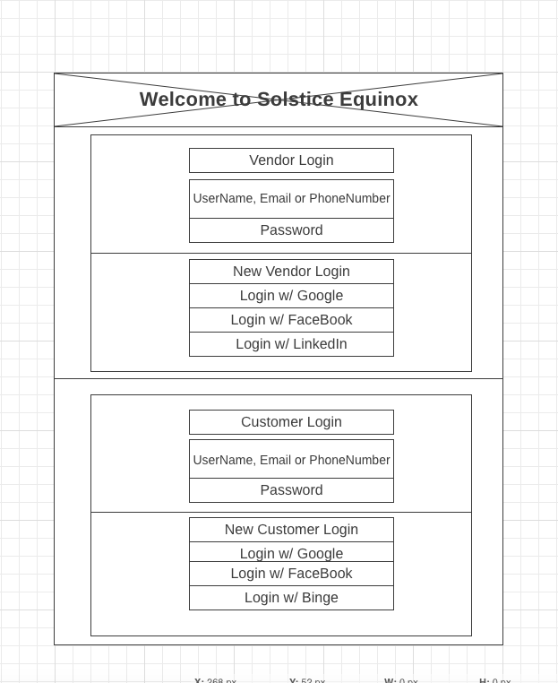
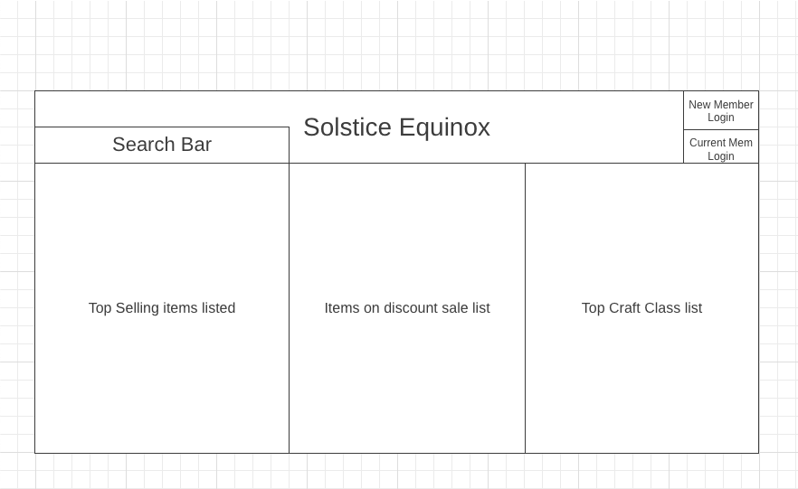
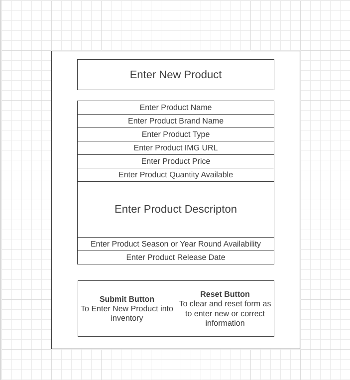

# App Planning Lab

## Getting Started

1. Fork and clone this repository.

1. Answer the questions below by editing this readme. Leave the questions and prompts, and answer in between them. Make sure when you read back your work that you've written things clearly, so that anyone reading it can easily understand what you've written.

1. Where applicable add screenshots, photos, and links.

1. You will also deploy an `index.html` page to GitHub pages.

## Instructions

You will be planning a new application to develop that will be a competitor for another popular application. Your goal is to determine the minimal functionality required so you can launch your app as soon as possible.

Choose from any popular app. It can be an app for anything:

- Music
- TV/Videos
- Shopping
- Social media
- Blog
- Forum (like Stack Overflow or Reddit)
- Chat app
- Recipes
- Business reviews

## Questions

## Project Managing Tool

#### In 1-3 sentences describe your application.

> My app is an online e-commerce store where customers can shop for seasonal/year round items provided by large corporations down and individual indie product makers. Think amazon meets etsy with a seasonal/holiday aspect being its main focus. 

#### What is the name of your application?

> APP NAME
> Solstice Equinox 

#### Create a minimum of 10 user stories. Make sure to use the format:

- `As a <type of user>, I want to <some goal>, so that <some reason>.`

Write the user stories below. Add more `>` for each user story or use `-` to make a list

> As a ...

> 1. `As a customer, I want to be able to filter products by price range, so I can quickly find items that fit within my budget.`

> 2. `As an online shopper, I want to receive email notifications when items on my wishlist go on sale, so I can take advantage of discounts.`

> 3. `As a seller, I want to have the ability to bulk upload product listings, so I can save time and efficiently manage my inventory.`

> 4. `As a customer, I want to see product reviews and ratings on the product detail page, so I can make informed purchasing decisions.`

> 5. `As a customer, I want to be able to save multiple shipping addresses in my account, so I can easily ship orders to different locations.`

> 6. `As an online shopper, I want to have a "wishlist" feature to save products for future reference, so I can easily keep track of items I'm interested in.`

> 7. `As a seller, I want to have access to real-time sales and inventory reports, so I can manage my stock and sales performance effectively.`

> 8. `As a customer, I want to be able to filter products by customer ratings, so I can quickly find highly recommended items.`

> 9. `As a seller, I want to receive notifications when a customer places an order, so I can fulfill orders promptly.`

> 10. `As a seller, I want to provide detailed product descriptions and specifications, so customers can make well-informed decisions before purchasing.`

> 11. `As a customer, I want to track the delivery status of my orders in real-time, so I can know when to expect the delivery.`

> 12. `As an online shopper, I want to have a secure and user-friendly checkout process with multiple payment options, so I can complete purchases easily and with confidence.`

> 13. `As a customer, I want to receive personalized product recommendations based on my browsing and purchase history, so I can discover new products I might like.`

> 14. `As a customer, I want to be able to leave product reviews and ratings, so I can share my experiences and help other shoppers make informed decisions.`

#### Create a new board

Follow the format provided (name of board, the 5 lists etc.) in the reading.

- Add a minimum of 5 cards (front only) based on your user stories to `Backlog`.
- Add appropriate labels.

Provide a link to your board below.

> [APP NAME board]()
> [SOLSTICE EQUINOX board](https://trello.com/b/bD81sZ9Q/solstice-equinox)

#### For one card, fill out more details, include:

- The business case
- Acceptance criteria
- Notes
- Resources

Move that card to the `Doing` list and assign yourself to it.

Provide a link to the specific card below.

> [Detailed card](https://trello.com/c/fx8LJS44/3-create-a-secure-and-user-friendly-checkout-process-with-multiple-payment-options)

#### Create one bug card.

Think back to a bug you had in a recent lab or project and do your best to model that example.
It can either be a bug you solved or that you didn't get a chance to solve.

It should include:

- A brief description of the bug.
- The expected behavior.
- The steps to reproduce.
- At least one resource.

Make sure to label it as a bug. Move the card to the `To Do` list.

Provide a link to the specific card below.

> [Bug card](https://trello.com/c/4GTSJgXJ/6-button-for-updating-inventory-stock-items-is-malfunctioning)

#### Create one chore card

Think back to a chore you had in a recent lab or project and model that example. Move the chore to the `Done` column.

- Assign yourself to it.
- Add a due date.

Provide a link to the specific card below.

> [Chore card](https://trello.com/c/GwFhm2RH/7-move-test-data-to-production-environment)

### Wireframes

Create three wireframes. You may use a free online tool or draw them on paper (you can either scan them or use your phone to photograph them). You will upload them to this repository.

1. Create a wireframe for the main page that shows an index view (on mobile).

> 

1. Create a wireframe for a wide desktop view for either the index view.

> 

1. Create a wireframe for the view that has a new form (new user, new shipping information, new post, new song, new product etc.) view (on mobile).

> 

## Minimum Viable Product

Create an `index.html` file and a `styles.css` file. Using your user stories and wireframes build the responsive `index` view. You should use `lorem ipsum` placeholder text and placeholder images, where applicable. The index view should have between 2 and 5 example resources.

Deploy this to GitHub pages.

## Reflection

Write down three things that went well for you doing this lab.
 
 - one: Building out the wireframe cards as I got use to the wireframe systme was fun and rewarding as it gave me a visual idea of how I wanted to make this product look. 
 - two: The Trello cards after gaining some experience system was very helpful as it allowed me to have a scope of the project. It also allowed me to manage the pieces of the project into bit size pieces. 
 - three: 

Write down one thing you'd improve on for next time.

> One thing I'd improve is time management and the alottment of time which was given to this mini-project given the strenous time crutches I was under at the given time. Would have loved to give it more of the attention it needed. 
