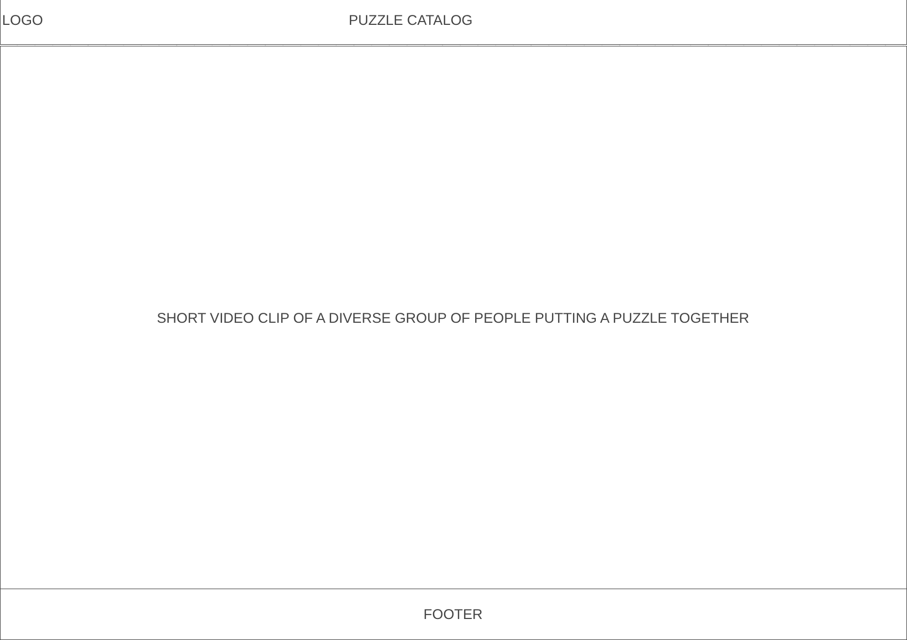
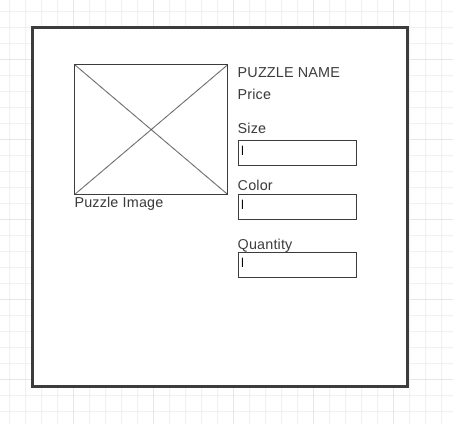

# App Planning Lab

## Getting Started

1. Fork and clone this repository.

1. Answer the questions below by editing this readme. Leave the questions and prompts, and answer in between them. Make sure when you read back your work that you've written things clearly, so that anyone reading it can easily understand what you've written.

1. Where applicable add screenshots, photos, and links.

1. You will also deploy an `index.html` page to GitHub pages.

## Instructions

You will be planning a new application to develop that will be a competitor for another popular application. Your goal is to determine the minimal functionality required so you can launch your app as soon as possible.

Choose from any popular app. It can be an app for anything:

- Music
- TV/Videos
- Shopping
- Social media
- Blog
- Forum (like Stack Overflow or Reddit)
- Chat app
- Recipes
- Business reviews

## Questions

## Project Managing Tool

#### In 1-3 sentences describe your application.

> My app gives puzzle lovers access to a ton of jigsaw puzzle they can rent. Once the jigsaw puzzle is complete, they can exchange it for a new one. 

#### What is the name of your application?

> Will Do Puzzles

#### Create a minimum of 10 user stories. Make sure to use the format:

 - As a puzzle enthusiast, I want to be able to rent a variety of jigsaw puzzles, without having to buy and store them all myself.
 - As a guest, I want to browse the catalog of available puzzles and see detailed information about each puzzle, such as the size, difficulty level, and theme. 
 - As a paid member, I want to add puzzles to my wishlist so that I can easily find them again later.
 - As a paid member, I want to pay for my subscription securely using my preferred payment method.
 - As a paid member, I want to be able to track the status of my rental orders and receive notifications when my puzzles are shipped and delivered.
  - As a paid or trial member, I want to return my completed puzzles easily and conveniently.
 - As a paid member, contact customer support if I have any problems with my rental.
 - As a paid member, I want to be able to rate and review puzzles that I have rented so other customers can see the feedback.
 - As a paid member, participate in puzzle challenges and competitions.
 - As a paid member, set up a recurring rental subscription so that they always have new puzzles to work on

#### Create a new board

Follow the format provided (name of board, the 5 lists etc.) in the reading.

- Add a minimum of 5 cards (front only) based on your user stories to `Backlog`.
- Add appropriate labels.

Provide a link to your board below.

> [Will Do Puzzles](https://trello.com/b/jCYV3jqS/will-do-puzzles)

#### For one card, fill out more details, include:

- The business case
- Acceptance criteria
- Notes
- Resources

Move that card to the `Doing` list and assign yourself to it.

Provide a link to the specific card below.

> [Detailed card](https://trello.com/c/gCrLtYCd)

#### Create one bug card.

Think back to a bug you had in a recent lab or project and do your best to model that example.
It can either be a bug you solved or that you didn't get a chance to solve.

It should include:

- A brief description of the bug.
- The expected behavior.
- The steps to reproduce.
- At least one resource.

Make sure to label it as a bug. Move the card to the `To Do` list.

Provide a link to the specific card below.

> [Bug card](https://trello.com/c/HBynq0Zk)

#### Create one chore card

Think back to a chore you had in a recent lab or project and model that example. Move the chore to the `Done` column.

- Assign yourself to it.
- Add a due date.

Provide a link to the specific card below.

> [Chore card](https://trello.com/c/pMIVHogy)

### Wireframes

Create three wireframes. You may use a free online tool or draw them on paper (you can either scan them or use your phone to photograph them). You will upload them to this repository.

1. Create a wireframe for the main page that shows an index view (on mobile).

> ![Index on mobile view] (../assets/mobile-page.png)

1. Create a wireframe for a wide desktop view for either the index view.

> 

1. Create a wireframe for the view that has a new form (new user, new shipping information, new post, new song, new product etc.) view (on mobile).

> 

## Minimum Viable Product

Create an `index.html` file and a `styles.css` file. Using your user stories and wireframes build the responsive `index` view. You should use `lorem ipsum` placeholder text and placeholder images, where applicable. The index view should have between 2 and 5 example resources.

Deploy this to GitHub pages.

## Reflection

Write down three things that went well for you doing this lab.
 
 - Getting a better understanding of bringing together html, css, js.
 - Experimenting with different workflows in putting an interactive website together.
 - Not only putting in the necessary time to complete the project but keeping it as simple as possible for the sake of time. 

Write down one thing you'd improve on for next time.

> One thing I'd improve is adding a little bit in the wireframe and spending more time finding better resources.
