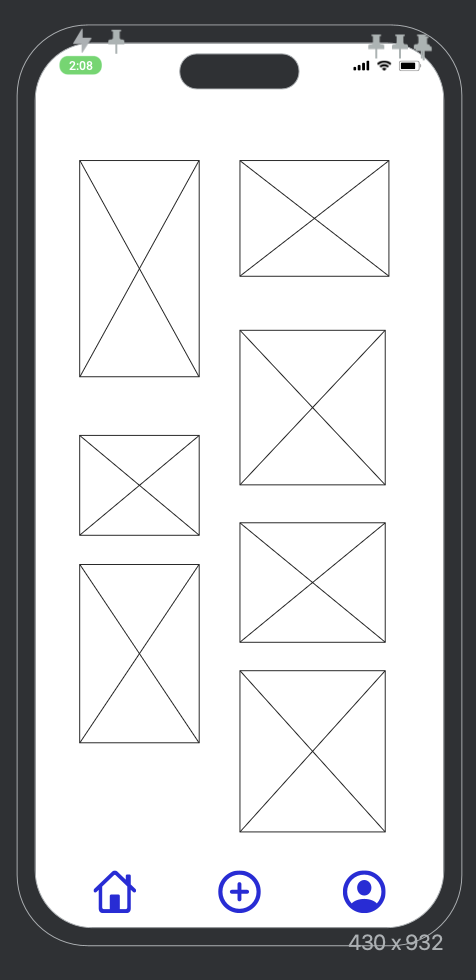
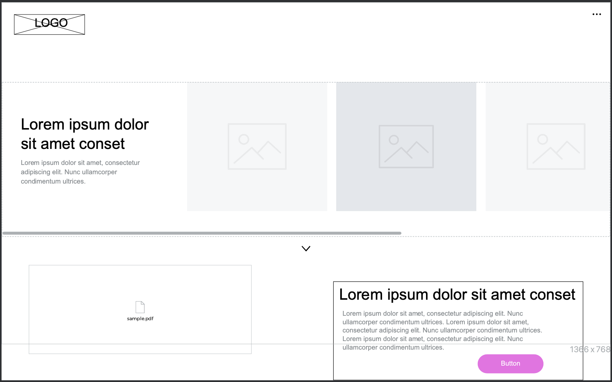
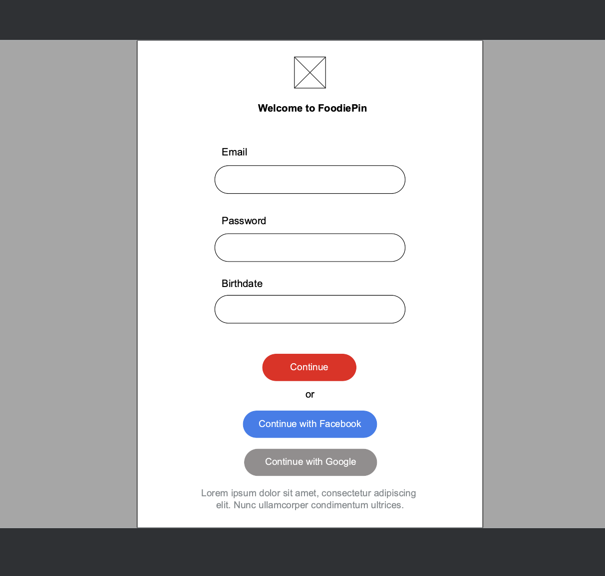

# App Planning Lab

## Getting Started

1. Fork and clone this repository.

1. Answer the questions below by editing this readme. Leave the questions and prompts, and answer in between them. Make sure when you read back your work that you've written things clearly, so that anyone reading it can easily understand what you've written.

1. Where applicable add screenshots, photos, and links.

1. You will also deploy an `index.html` page to GitHub pages.

## Instructions

You will be planning a new application to develop that will be a competitor for another popular application. Your goal is to determine the minimal functionality required so you can launch your app as soon as possible.

Choose from any popular app. It can be an app for anything:

- Music
- TV/Videos
- Shopping
- Social media
- Blog
- Forum (like Stack Overflow or Reddit)
- Chat app
- Recipes
- Business reviews

## Questions

## Project Managing Tool

#### In 1-3 sentences describe your application.

> My app ... **My app is a recipe sharing platform where users can discover, share, and discuss their favorite recipes. Users can create profiles, upload recipes with photos, and engage in a community of food enthusiasts.**

#### What is the name of your application?

> APP NAME ... **FoodiePin**

#### Create a minimum of 10 user stories. Make sure to use the format:

- `As a <type of user>, I want to <some goal>, so that <some reason>.`

Write the user stories below. Add more `>` for each user story or use `-` to make a list

> As a ...

- As a **foodie**, I want to **create a profile, so that I can share my favorite recipes with others**.

- As a **diy enthusiast**, I want to **browse recipes by category, so that I can find new and interesting dishes to try**.

- As a **home cook**, I want to **upload my own recipes with ingredients and instructions, so that others can recreate my dishes**.

- As a **user**, I want to **save recipes to my personal collection, so that I can easily find and access them later**.

- As a **food enthusiast**, I want to **comment on recipes, so that I can share tips, ask questions, or provide feedback**.

- As a **user**, I want to **search for recipes based on ingredients, so that I can find recipes using items I have at home**.

- As a **cookbook lover**, I want to **create and share my own digital cookbook, so that I can curate a collection of my favorite recipes**.

- As a **user**, I want to **receive notifications about new recipes from chefs I follow, so that I can stay updated on their latest creations**.

- As a **community member**, I want to **participate in cooking challenges, so that I can showcase my skills and discover unique recipes**.

- As a **user**, I want to **customize my profile with a profile picture and bio, so that I can personalize my presence on FoodiePin**.

#### Create a new board

Follow the format provided (name of board, the 5 lists etc.) in the reading.

- Add a minimum of 5 cards (front only) based on your user stories to `Backlog`.
- Add appropriate labels.

Provide a link to your board below.

> [APP NAME board]()

#### For one card, fill out more details, include:

- The business case
- Acceptance criteria
- Notes
- Resources

Move that card to the `Doing` list and assign yourself to it.

Provide a link to the specific card below.

> [Detailed card](https://trello.com/c/03KCIYUi)

#### Create one bug card.

Think back to a bug you had in a recent lab or project and do your best to model that example.
It can either be a bug you solved or that you didn't get a chance to solve.

It should include:

- A brief description of the bug.
- The expected behavior.
- The steps to reproduce.
- At least one resource.

Make sure to label it as a bug. Move the card to the `To Do` list.

Provide a link to the specific card below.

> [Bug card](https://trello.com/c/QPYUch94)

#### Create one chore card

Think back to a chore you had in a recent lab or project and model that example. Move the chore to the `Done` column.

- Assign yourself to it.
- Add a due date.

Provide a link to the specific card below.

> [Chore card](https://trello.com/c/nFmVwf3u)

### Wireframes

Create three wireframes. You may use a free online tool or draw them on paper (you can either scan them or use your phone to photograph them). You will upload them to this repository.

1. Create a wireframe for the main page that shows an index view (on mobile).

> 

1. Create a wireframe for a wide desktop view for either the index view.

> 

1. Create a wireframe for the view that has a new form (new user, new shipping information, new post, new song, new product etc.) view (on mobile).

> 

## Minimum Viable Product

Create an `index.html` file and a `styles.css` file. Using your user stories and wireframes build the responsive `index` view. You should use `lorem ipsum` placeholder text and placeholder images, where applicable. The index view should have between 2 and 5 example resources.

Deploy this to GitHub pages.

## Reflection

Write down three things that went well for you doing this lab.
 
 - Creating trello cards
 - Creating wireframes
 - Coming up with the app name

Write down one thing you'd improve on for next time.

> One thing I'd improve ...
One thing I'd improve is more so not trying to do everything at once, but taking everything as individual pieces.
